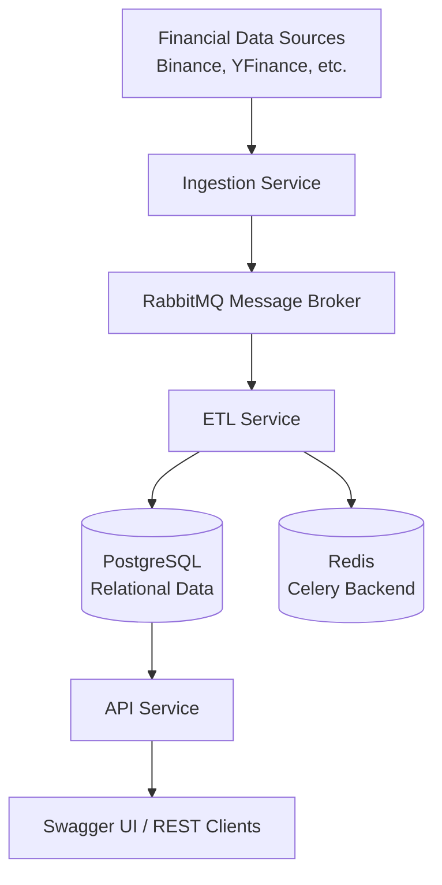

# 🚀 MarketFlow: Financial Data ETL Platform


MarketFlow is a professional-grade asynchronous, fault-tolerant, and scalable financial data ETL (Extract, Transform, Load) platform. It is designed to ingest real-time and historical data from diverse sources including Crypto, Equities, Commodities, and Bonds.

## 🏗️ Architecture
MarketFlow utilizes an **Event-Driven Microservices** architecture with Celery workers for distributed task processing.



## 🛠️ Tech Stack
- **Core:** Python 3.12, FastAPI, SQLAlchemy 2.0, Pydantic V2
- **Data Fetching:** Httpx, yfinance
- **Messaging:** RabbitMQ (Message Broker)
- **Task Queue:** Celery + Redis
- **Database:** PostgreSQL (with automated schema creation)
- **Ops:** Docker, Docker Compose, GitHub Actions (CI/CD)

## 📦 Service Breakdown
- **`ingestion_service`**: Fetches raw data and triggers processing tasks.
- **`etl_service`**: Standardizes data and calculates metrics (MA, RSI).
- **`api_service`**: Serves processed data via RESTful endpoints.
- **`common`**: Shared logic for models, database, and configuration.

## 🚦 Getting Started

### Prerequisites
- Docker & Docker Compose

### Local Development Setup
1. Clone the repository and copy environment variables:
   ```bash
   cp .env.example .env
   ```
2. Start the entire stack:
   ```bash
   docker-compose -f docker-compose.dev.yml up -d --build
   ```
3. The API will automatically create all necessary database tables on startup.

## 🛠️ Monitoring & Tools
| Tool | URL | Credentials |
| :--- | :--- | :--- |
| **API (Swagger)** | `http://localhost:8000/docs` | None |
| **Celery Flower** | `http://localhost:5555` | None |
| **RabbitMQ Management** | `http://localhost:15672` | `marketflow` / `marketflow` |

## 🧪 Testing
We use `pytest` for unit and integration testing.

### Running Tests Locally
To run tests, ensure your test database container is running:
1. Start the test DB: `docker-compose -f docker-compose.dev.yml up -d postgres-test redis`
2. Run tests:
   ```bash
   export PYTHONPATH=.
   pytest tests/
   ```

## � CI/CD Pipeline
Our pipeline is automated via **GitHub Actions**:
- **CI:** Lints (Ruff), Type checks (MyPy), and Runs Tests on every push.
- **CD:** (Planned) Automatic deployment to AWS EKS.

## 📄 License
MIT License.
