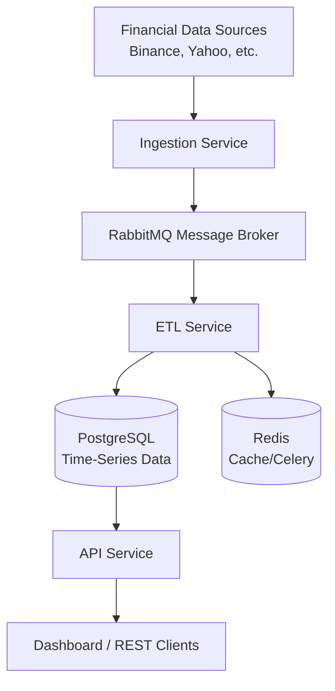

# 🚀 MarketFlow: Financial Data ETL Platform

MarketFlow is an asynchronous, fault-tolerant, and scalable financial data ETL (Extract, Transform, Load) platform designed to handle real-time and historical data from various sources including Crypto, Equities, Indices, and Forex.

## 🌟 Mission
To provide a professional-grade infrastructure for backend engineering development, demonstrating best practices in microservices architecture, event-driven design, and system reliability.

## 🏗️ Architecture
MarketFlow utilizes an **Event-Driven Microservices** architecture to ensure high performance and loose coupling.



## 🛠️ Tech Stack
- **Languages:** Python 3.12+
- **Frameworks:** FastAPI (API & Ingestion)
- **Message Broker:** RabbitMQ
- **Database:** PostgreSQL (Relational/Time-Series)
- **Task Queue:** Celery + Redis
- **Containerization:** Docker & Docker Compose
- **Orchestration:** Kubernetes (Planned)

## 📦 Service Breakdown
- **`ingestion-service`**: Handles data fetching from external providers and publishes events to RabbitMQ.
- **`etl-service`**: Consumes raw data, performs normalization/cleaning, and stores it in PostgreSQL.
- **`api-service`**: Serves processed data to end-users via RESTful endpoints.
- **`common`**: Shared library containing database models, configurations, and core utilities.

## 🚦 Getting Started

### Prerequisites
- Docker & Docker Compose
- Make (Optional)

### Installation
1. Clone the repository:
   ```bash
   git clone https://github.com/your-username/MarketFlow.git
   cd MarketFlow
   ```
2. Set up environment variables:
   ```bash
   cp .env.example .env
   ```
3. Start the infrastructure and services:
   ```bash
   docker-compose up -d --build
   ```

## 🚀 CI/CD Pipeline (Planned)
We are implementing a robust CI/CD pipeline using **GitHub Actions**:
- **Continuous Integration:** Automatic linting (Ruff), type checking (MyPy), and unit testing on every push.
- **Continuous Deployment:** Automated Docker image builds and push to Amazon ECR, followed by deployment to EKS (AWS).

## 🗺️ Professional Roadmap
For a detailed guide on how this project is evolving to a professional level, check out our [Professional Roadmap](PROFESSIONAL_ROADMAP.md).

## 📄 License
This project is licensed under the MIT License.
